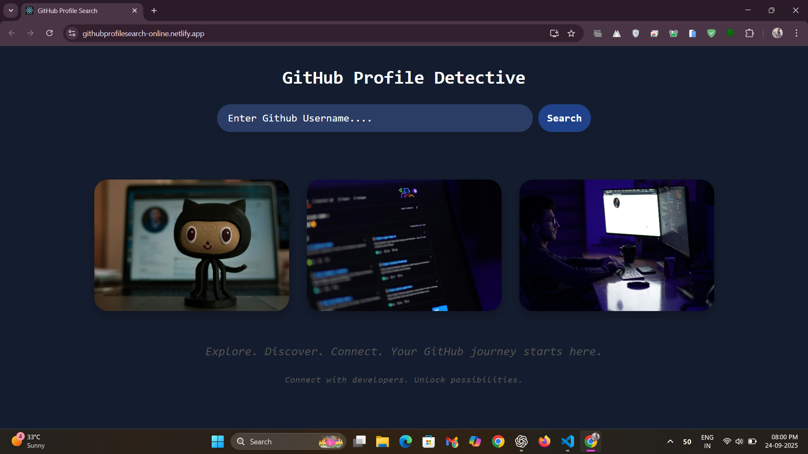
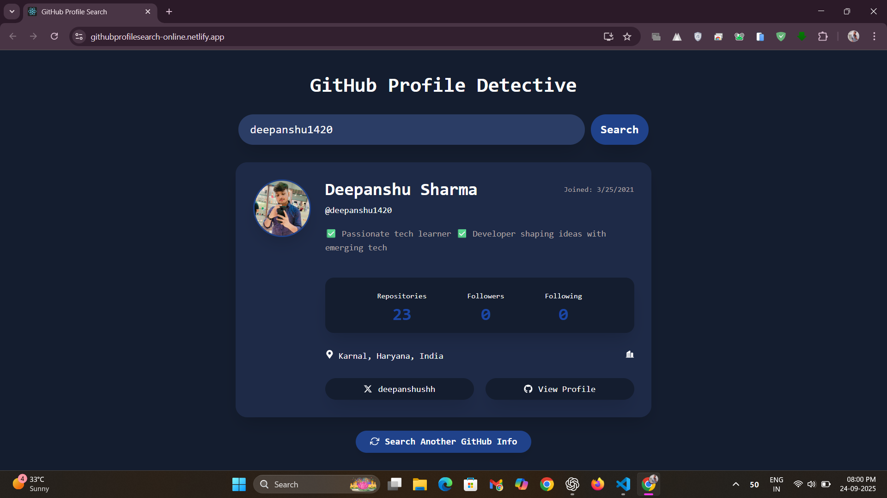
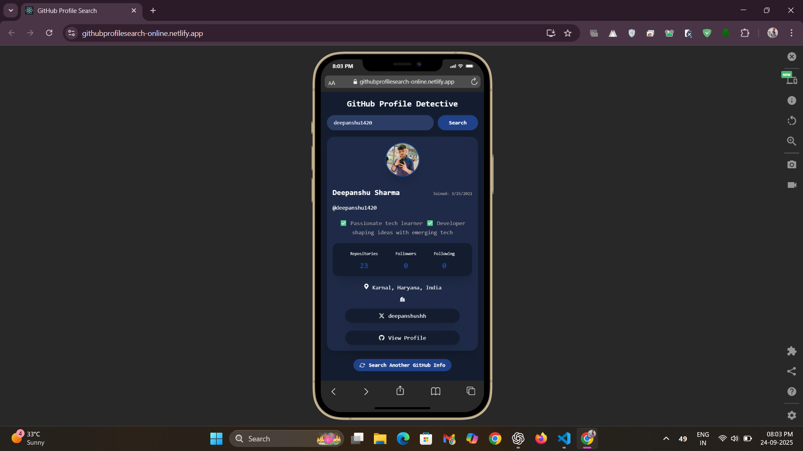

# 🔍 GitHub Profile Search App


**A web app to search and view GitHub user profiles using the GitHub REST API.**

---

🌐 [Live Demo](http://githubprofilesearch-online.netlify.app)

---

## ⚡ Overview
The GitHub Profile Search App allows users to quickly find GitHub profiles by username and view key details such as bio, repositories, followers, and more. Built with React and styled using HTML/CSS, it integrates the GitHub REST API for real-time profile data.

---

## 🛠 Features
- **Search GitHub users** by username.
- **Display user profile details**: avatar, bio, location, followers, following, repo count.
- **Responsive design** for mobile and desktop.
- **Live data fetching** using the GitHub REST API.

---

## Screenshots

### Home Page
  
*🏠 Sleek, interactive landing page enabling instant GitHub profile lookup via usernames.*

### Search Page
  
*⚡ Displays searched user profiles with detailed stats, bio, and links.*

### Mobile View
  
*📱 Fully responsive design optimized for mobile screens.*

---

## 🚀 Installation
```bash
# Clone the repository
git clone <your-repo-link>

# Go to the project folder
cd GitHubProfileSearch

# Install dependencies
npm install

# Start the dev server
npm start
