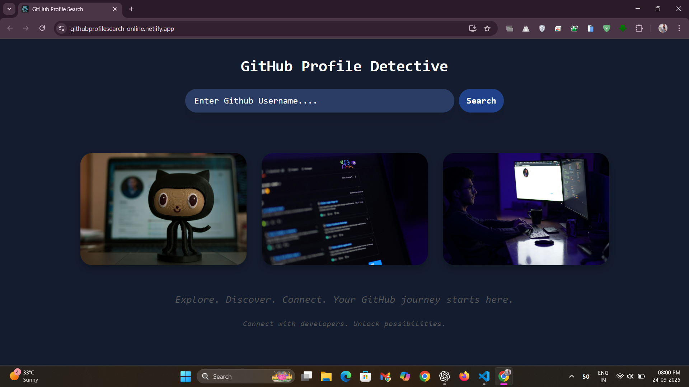
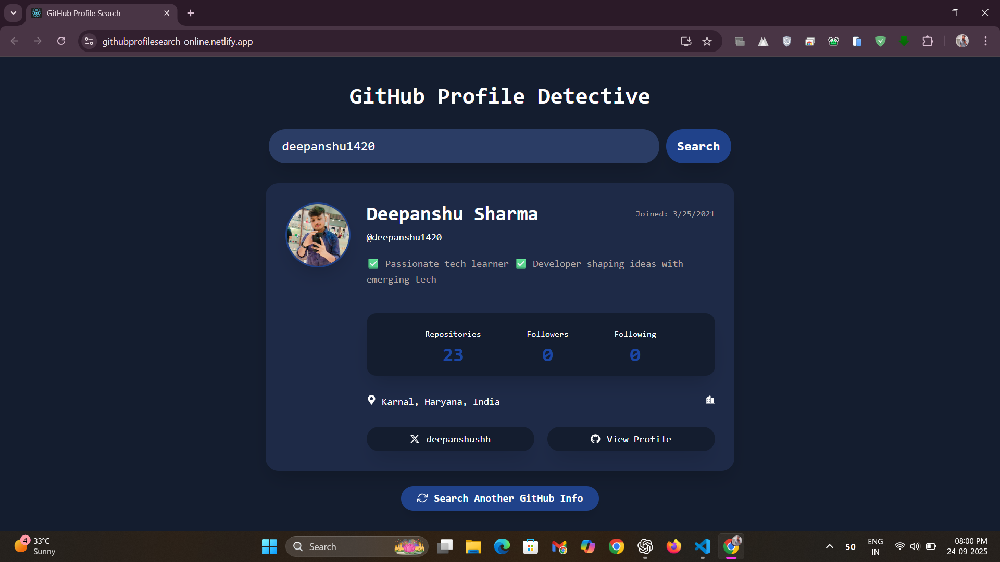
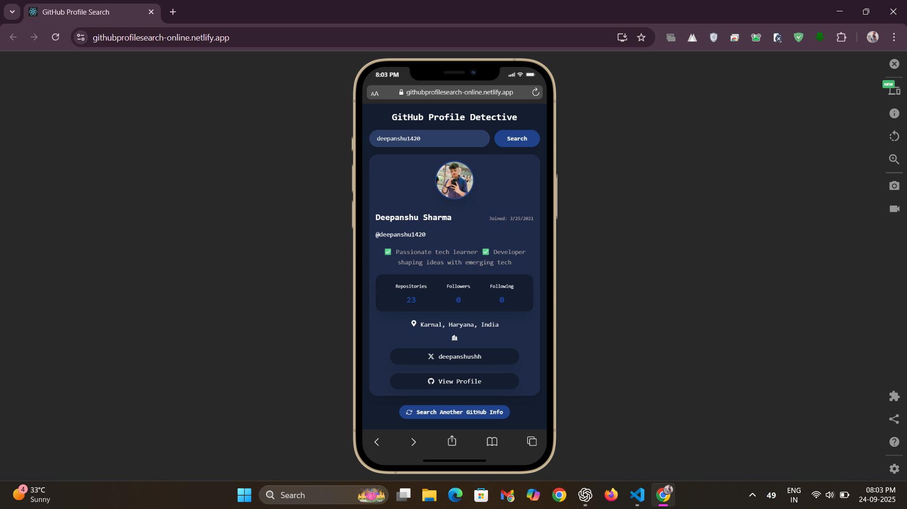

# 🔍 GitHub Profile Search


**A web app to search and view GitHub user profiles using the GitHub REST API.**

**🌐 Search any GitHub profile :** [Live Demo](https://githubprofile-search.vercel.app/) 

## ⚡ Overview
The GitHub Profile Search App allows users to quickly find GitHub profiles by username and view key details such as bio, repositories, followers and more. Built with React and styled using HTML/CSS, it integrates the GitHub REST API for real-time profile data.

## 🛠 Features / Highlights
- 🔍 **Search GitHub users** instantly by entering any GitHub username.
- 👤 **Display detailed user profiles** including avatar, bio, location, followers and total repositories count.
- 📱 **Responsive and modern UI design** optimized for both mobile devices and desktop screens.
- ⚡ **Live data fetching** integrated with the GitHub REST API for real-time profile information.

## Screenshots / Demo

### 🏠 Home Page
  
*Sleek, interactive landing page enabling instant GitHub profile lookup via usernames.*

### ⚡ Search Page
  
*Displays searched user profiles with detailed stats, bio and links.*

### 📱 Mobile View
  
*Fully responsive design optimized for mobile screens.*

## 🛠 Tech Stack Used

- ⚛️ **Frontend:** HTML5, CSS3  
- 🧩 **Framework / Library:** React.js
- 🟨 **Programming Language:** JavaScript (ES6)  
- 🔗 **API Integration:** GitHub REST API  
- 🌐 **Deployment:** Netlify  
- 🛠️ **Version Control:** Git & GitHub  

## ⚙️ Setup & Installation
```bash
# Clone the repository
git clone https://github.com/deepanshu1420/GitHubProfileSearch.git

# Navigate to the project folder
cd GitHubProfileSearch

# Install dependencies
npm install

# Start the development server
npm start
```
